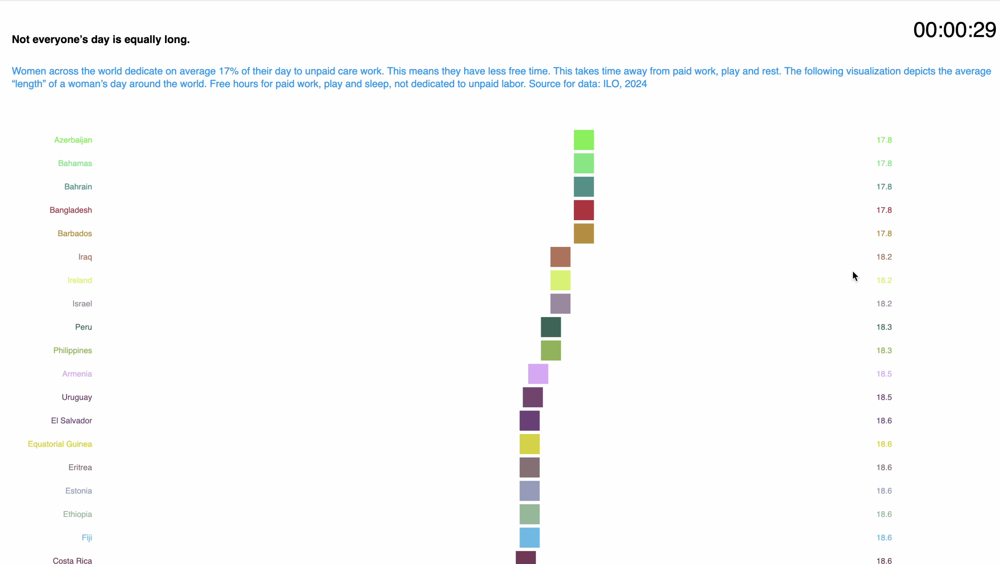
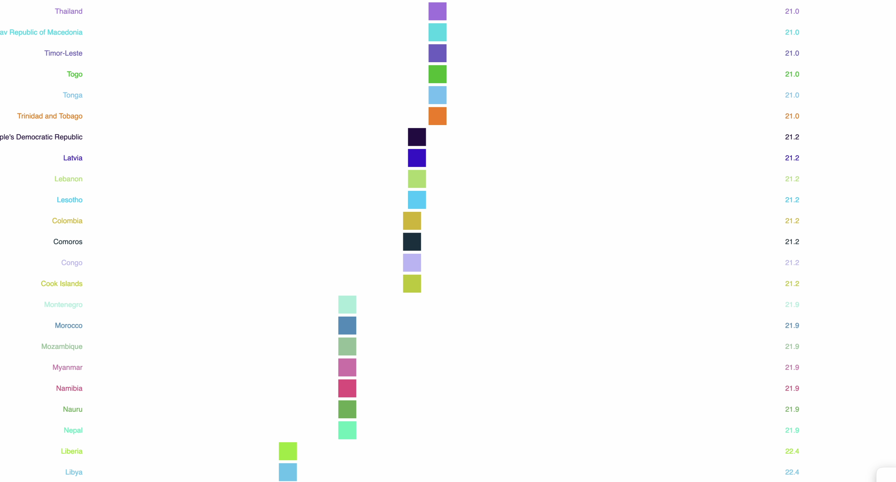
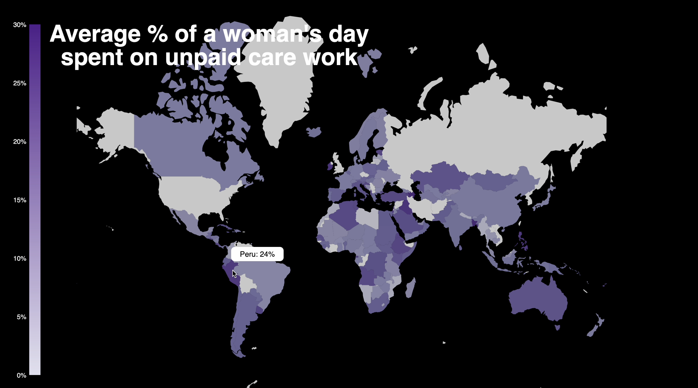

# Analyzing and Visualizing Unpaid Labor

## Overview

This project addresses the pressing issue of unpaid labor, specifically focusing on the gendered dimensions of domestic work, caregiving, food production, and volunteering. The COVID-19 pandemic has magnified the challenges faced by women in balancing paid and unpaid work. Despite decades of feminist advocacy, the unequal distribution of unpaid labor remains a significant barrier to achieving gender equality.

## Context and Problem

### Context

Unpaid labor includes essential tasks such as household chores and caregiving, which predominantly fall to women. The pandemic has highlighted the disproportionate burden of unpaid work shouldered by women, reflecting broader systemic gender inequalities. Women globally spend approximately 12 billion hours each day on unpaid work, contributing substantially to the economy while remaining undervalued.

### Problem

Unpaid work, including domestic chores and caregiving, is a crucial yet unrecognized component of global economic activity. Women spend significantly more time on these tasks compared to men, resulting in a double burden: managing both paid and unpaid work. This imbalance contributes to persistent gender inequalities in both personal and professional spheres.

## Motivation

The motivation behind this project is to shed light on the origins of unpaid labor disparities rooted in gender norms and to highlight their pervasive impact on individuals and society. By exploring how these norms shape expectations and opportunities, we aim to inspire action and foster a more equitable society. This project seeks to challenge existing paradigms and advocate for meaningful changes in societal and economic structures.

## Purpose

The purpose of this project is to bridge the gap between complex data analysis and everyday understanding. We aim to make intricate statistics about unpaid labor accessible and relatable, transforming raw data into compelling narratives that highlight the urgency of addressing gender inequality.

## Audience

This project targets individuals with basic education and internet access, aiming to democratize data and make it relevant to everyday life. By engaging this audience through accessible storytelling, we seek to empower people with the knowledge to recognize and advocate for the importance of equitable distribution of unpaid work.

## Data

### Data Sources

The data used in this project is sourced from reputable organizations and covers various dimensions of unpaid labor:
- **Proportion of Time Spent on Unpaid Work:** World Bank ([Link](https://data.worldbank.org/indicator/SG.TIM.UWRK.FE))
- **Number of Informal Care Employees, Volunteers, Subsistence Food Producers:** International Labour Organization (ILO) ([Link](https://rshiny.ilo.org/dataexplorer14/?lang=en&id=FOW_T_VOL_SEX_VOL_NB_A))

### Data Collection

The data is collected from international surveys and government reports, ensuring a broad and representative sample. The datasets include information on domestic work, caregiving, food production, and volunteering across multiple countries.

## Data Quality

### Cleaning and Validation

Data cleaning involved:
- Removing countries with incomplete data.
- Eliminating unnecessary internal columns.
- Renaming and adjusting data types.

We used tools like Excel, Visual Basic, and Tableau Prep for data cleaning. The dataset was validated for accuracy, and additional variables were created to reveal trends and insights.

### Data Gaps and Bias

The dataset exhibits regional disparities and incomplete coverage for some countries. Despite these limitations, the primary data sources are reputable, and privacy and consent issues are appropriately managed.

## Data Analysis

### Analysis Techniques

The analysis was exploratory, aiming to pose questions rather than provide definitive answers. It included:
- Descriptive statistics on unpaid labor by sex, country, and region.
- Trend analysis to observe changes over time.

## Data Visualization

### Visualizations

Visualizations are categorized to provide:
1) An overview of global unpaid work
2) Trends in informal care work
3) Trends in subsistence food production 
4) Additional insights on volunteering and care work
5) Global Breakdown: How Many Hours Women Truly Have in Their Day
6) Mapping the distributing of unpaid work between sexes

Interactive elements allow users to explore data, with future plans to include accessibility features such as ALT text for visually impaired users.

## Process

Visualizations 1-5 were developed on tableau, while  5 and 6 were developed using P5 and D3 respectively. For visualization 5, GEOcode map to graph the data by country and for 6 P5 visualization commonly used to represent numbers, it was used it to represent the lenght/speed of womens day in terms of the number of hours they have free from unpaid labor.

### Tableau Dashboards

### P5 and D3 Visualizations

## Conclusions

1**Call for Policy Action: This project highlights the urgent need for policy reforms to mitigate and equitably distribute unpaid work.** 
Essential actions include:
- Promoting paid employment in the care sector.
- Encouraging equitable sharing of care and domestic duties among all genders.
- Addressing global data inconsistencies and enhancing ethical data collection practices.
- Ethical Data Considerations: One major takeaway involves scrutinizing data ethics. The data collected for this project, like many international datasets, reveals inherent biases. Certain regions and countries are underrepresented, and data coverage varies. While privacy and transparency were upheld, as the data came from government surveys with no personal identifiers, the gaps and disparities in the data call for improved global data practices.

2. **Analytical Approach: The project's analysis was exploratory, aiming to provoke thought rather than provide definitive answers.**
The approach included:
- Descriptive statistics examining gender differences across regions in subsistence food production, volunteering, and informal care work.
- Trend analysis to observe how these disparities evolved over time, offering a dynamic view of gender inequality. The dashboards in the Annex illustrate these findings.

4. **Integrating Data Feminism:**
- The importance of incorporating emotional and embodied experiences into data analysis.
- Emphasizing these dimensions can foster more empathetic and informed policymaking.
- The necessity of acknowledging and making visible the labor involved in data collection and analysis.
- This transparency ensures that data-driven decisions are accountable and resonate with the real experiences of the communities they affect.

Interactive elements allow users to explore detailed data and adjust parameters. Although disability considerations were not addressed in this iteration, plans include adding ALT text for accessibility in future updates.

## References

- [Our World in Data: Female Labor Supply](https://ourworldindata.org/female-labor-supply)
- [HM Government: Unpaid and Unrecognized](https://assets.publishing.service.gov.uk/media/60ae4501d3bf7f7383db35fc/Unpaid-and-Unrecognised1.pdf)
- [International Labour Organization: Care Economy](https://www.ilo.org/global/topics/care-economy/lang--en/index.htm)
- [OECD: Redefining Reality](https://www.oecd-forum.org/posts/redefining-reality-the-truth-behind-the-unpaid-care-economy)
- [Office for National Statistics: Women and Unpaid Work](https://www.ons.gov.uk/employmentandlabourmarket/peopleinwork/earningsandworkinghours/articles/womenshouldertheresponsibilityofunpaidwork/2016-11-10)
- [UN Women: Forecasting Time Spent in Unpaid Care](https://www.unwomen.org/sites/default/files/2023-10/technical-brief-forecasting-time-spent-in-unpaid-care-and-domestic-work-en.pdf)
- [UNICEF: Gender Norms and Unpaid Work](https://data.unicef.org/topic/gender/gender-norms-and-unpaid-work/)

 
